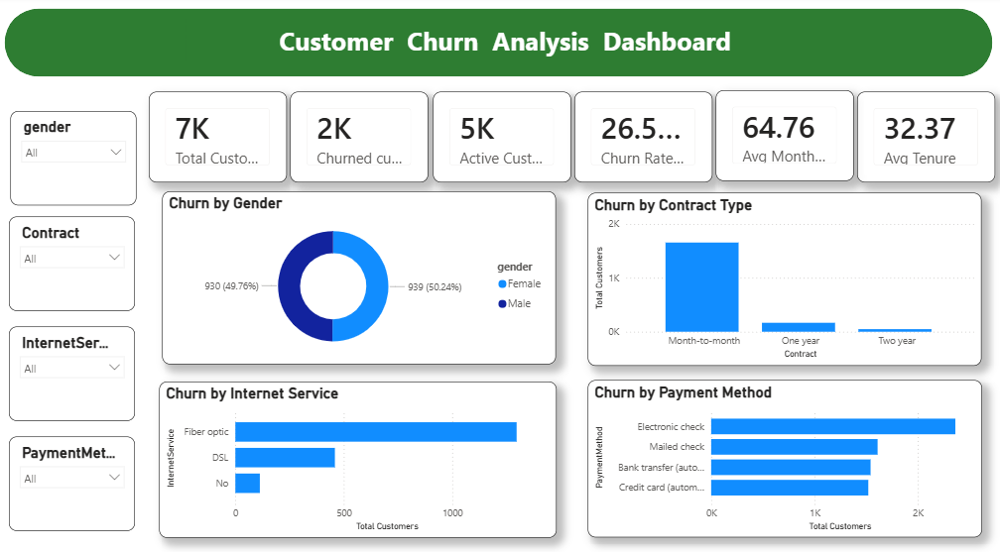

# Customer Cohort Analysis Dashboard

## 📌 Project Overview

This project presents an interactive **Customer Cohort Analysis Dashboard** built in **Power BI** using the Online Retail dataset. The dashboard helps analyze customer retention, repeat purchase behavior, revenue trends, and cohort performance over time through interactive visualizations.

---

## 🎯 Business Problem

Understanding customer retention is essential for every business. While acquiring new customers is important, retaining existing customers has a greater impact on long-term profitability.

This dashboard helps answer questions such as:

- How well are customers retained over time?
- Which customer cohorts have the highest retention rates?
- Which countries generate the most revenue?
- How do sales change over time?
- How many customers return after their first purchase?

---

## 🎯 Project Objectives

- Perform data cleaning using Power Query.
- Create a Cohort Analysis model using DAX.
- Analyze customer retention by cohort.
- Track monthly revenue trends.
- Identify top-performing countries.
- Build an interactive Power BI dashboard.

---

## 📊 Dataset Information

- **Dataset:** Online Retail Dataset
- **Source:** UCI Machine Learning Repository
- **Records:** ~540,000 transactions
- **Industry:** Retail / E-Commerce

---

## 🛠 Tools & Technologies

- Power BI
- Power Query
- DAX (Data Analysis Expressions)
- Data Modeling
- Microsoft Excel

---

## 📈 Dashboard Features

- Total Revenue KPI
- Total Customers KPI
- Total Orders KPI
- Average Retention KPI
- Monthly Revenue Trend
- Top 10 Countries by Revenue
- Customer Cohort Retention Matrix
- Country Filter
- Invoice Date Filter

---

## 📷 Dashboard Preview



---

## 📌 Key KPIs

- Total Revenue
- Total Customers
- Total Orders
- Average Customer Retention

---

## 🔍 Key Insights

- The first month consistently shows the highest customer retention.
- Customer retention gradually decreases over time across most cohorts.
- The United Kingdom generates the highest revenue.
- Revenue trends vary throughout the year with noticeable seasonal changes.
- A small percentage of customers become long-term repeat buyers.

---

## 💡 Business Recommendations

- Improve customer retention through loyalty and rewards programs.
- Focus marketing efforts on high-value customer cohorts.
- Re-engage inactive customers with personalized campaigns.
- Expand strategies used in top-performing countries.
- Monitor monthly retention trends to improve customer lifetime value.

---

## 📂 Repository Structure

```
customer-cohort-analysis-powerbi/
│
├── Customer_Cohort_Analysis.pbix
├── Online Retail.xlsx
├── Customer_Churn_Analysis_Screenshot.png
├── README.md
```

---

## 👨‍💻 Author

**Fida Muhammad Khan**

Aspiring Data Analyst passionate about transforming raw data into meaningful business insights using Power BI, Excel, SQL, and Python.

---

## ⭐ If you found this project useful, please consider giving it a Star!
